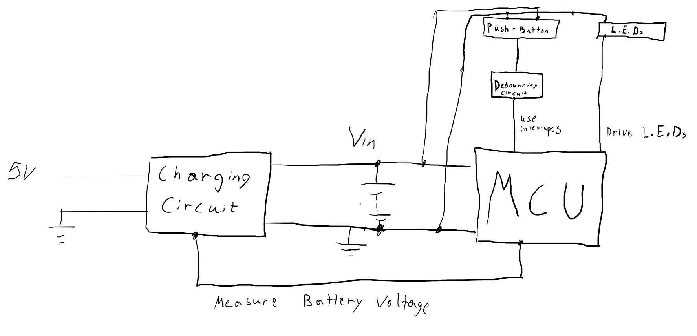

# Smart Asthma-Inhaler draft design

By Youssef Beltagy

This is a high-level design to guide our thinking, put it in context, and structure it. We haven't decided on which components to use for each specific part.

## Challenges

- Power (how long to keep the inhaler up) Expand this
- Space (how much physical space do we have)
- Data volatility (maintain data across reboots)
- Time-tracking (to record when the inhaler was used)
- Actuator (will the ME team use a nebulizer/vaporizer?)

## Solutions

For power, we can minimize the power required by the system by putting the Microprocessor to sleep all the time and have it wake up when an interrupt comes from the push-button(s).

We need a micro-processor with Low-power Bluetooth to communicate with the Phone App.

If we minimize the power consumption, we can reduce the required battery capacity and size. However, we need to know how much physical space the ME team will give us before we make decision. We also need to inform them on what would be a realistic size for the system.

Dr. Peng recommended us to use FRAM to store the count of inhaler uses. He explains that FRAM is a low power non-volatile memory. FRAM is made specifically for situations like ours.

We need a Microprocessor that has a real time clock or a real time clock IC to record when the inhaler was used. Tracking the time and frequency of inhaler uses will be much more meaningful and useful for the user than simply keeping track of context-less count.

## Notes

- Vin depends on the microprocessor. We need to decide on a Microprocessor first.
- We need to agree on how much space the ME team will give us.
- If the ME team decides to go forward with a nebulizer, power consumption must be considered.
- We need to measure the battery voltage to warn the user when the battery is almost empty and to possibly go into a low-power-mode.